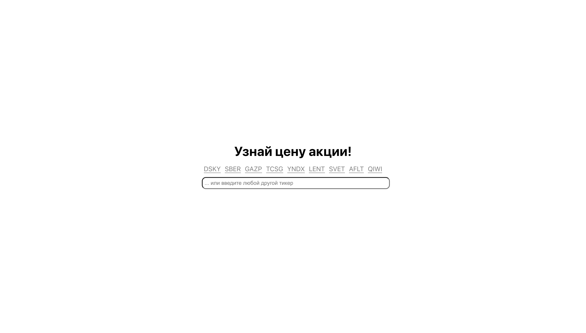
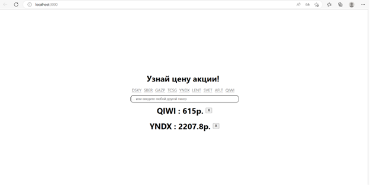

# Разработка виджета, отображающего котировки акций
Выполнила Демьяненко Д.С. АП-026

Запустить проект:
Склонировав (git clone) репозиторий, нужно прописать:

npm start
Приложение запустится, в браузерной строке открыть http://localhost:3000.

